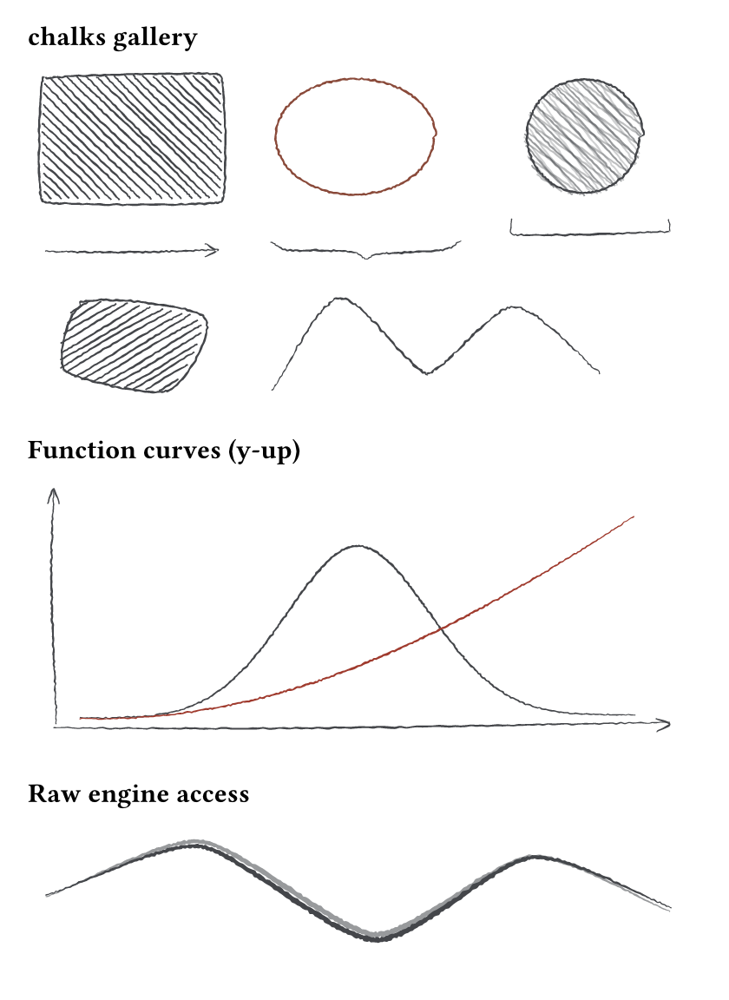
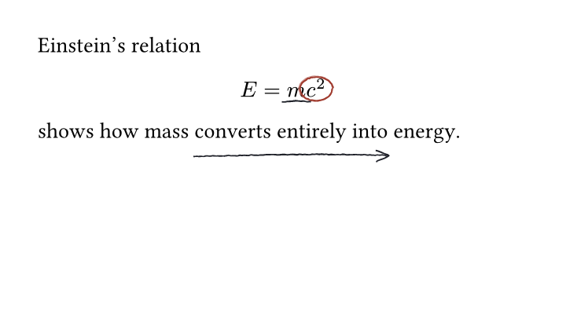
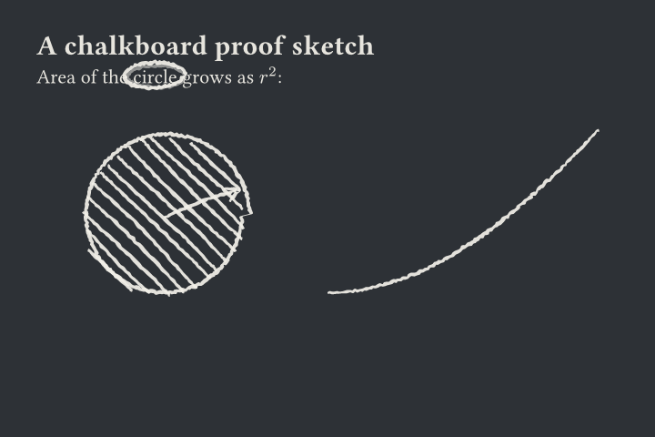

# chalks

Hand-drawn pencil and chalk figures for [Typst](https://typst.app), for
presenting scientific ideas — annotate equations like a lecturer at a
blackboard, sketch qualitative curves and geometric schematics that read as
"cartoon, not data". Shapes are generated in pure Typst; a Rust → WASM
engine turns them into sketchy, variable-width filled outlines with jitter,
bowing, pressure taper, and doodle fills. Figures stay vector and compile
with no external tooling.

<table>
<tr>
<td align="center"><a href="chalks/examples/gallery.typ"></a><br>every primitive and fill pattern</td>
<td align="center"><a href="chalks/examples/annotated-equation.typ"></a><br>pin &amp; annotate typeset math</td>
<td align="center"><a href="chalks/examples/chalkboard.typ"></a><br>chalk theme on a dark board</td>
</tr>
</table>

## Packages

| Package | Purpose | Version |
| --- | --- | --- |
| [`chalks`](chalks/) | Sketch canvas, shape/curve builders, pin-anchored annotations, and `pencil`/`ink`/`chalk` themes. | 0.1.0 |
| [`chalks-engine`](chalks-engine/) | Rust crate (compiled to a bundled WASM plugin) generating the hand-drawn geometry: smoothing, jitter, taper, hachure/shade fills. | 0.1.0 |

Only two operations cross the WASM boundary — `stroke` and `fill` — both
deterministic per seed, so unchanged figures never re-roll between compiles.

## Installation

Once published to [Typst Universe](https://typst.app/universe), importing it
is all you need — Typst downloads the package on first compile:

```typst
#import "@preview/chalks:0.1.0" as chalks
```

Until then (or to use your local checkout), clone the repo and link the
package into Typst's local package directory:

```sh
git clone https://github.com/GiggleLiu/chalks
cd chalks
make install   # symlinks chalks/ into {data-dir}/typst/packages/preview/chalks/0.1.0
```

after which the same `@preview/chalks:0.1.0` import resolves locally. To do
it by hand instead, symlink the `chalks/` directory to
`~/Library/Application Support/typst/packages/preview/chalks/0.1.0` (macOS)
or `${XDG_DATA_HOME:-~/.local/share}/typst/packages/preview/chalks/0.1.0`
(Linux).

## Quick start

A sketch is a plain coordinate canvas of hand-drawn primitives:

```typst
#import "@preview/chalks:0.1.0" as chalks

#chalks.sketch(240pt, 120pt,
  chalks.rect((10, 10), (90, 60), fill: "hachure"),
  chalks.circle((160, 40), 30, fill: "shade"),
  chalks.arrow((105, 40), (125, 40)),
  chalks.brace((10, 85), (100, 85), amplitude: 10),
)
```

Annotations anchor onto typeset content by name — pin a spot, then draw on
it from anywhere later on the page:

```typst
#import "@preview/chalks:0.1.0": annotate, pin

$ E = m #pin("c2")[$c^2$] $
#annotate(circle: "c2", color: red)
```

Every call accepts style overrides (`roughness: 1.5`, `smoothness: 0.2`,
`seed: 42`, …), and `#chalks.chalks-theme(chalks.chalk)` switches the whole
document to light-on-dark chalk for slides. See [`chalks/README.md`](chalks/README.md)
for the full API and style-key reference, and
[`chalks/manual.typ`](chalks/manual.typ) for a compiled walkthrough.

## Development

```sh
make test      # cargo test + plugin rebuild + full Typst suite (incl. manual) with local @preview resolution
make examples  # compile chalks/examples/*.typ
make images    # re-render the gallery PNGs
make plugin    # rebuild plugin/chalks_engine.wasm with the pinned toolchain
               # (commit the x86_64 Linux build: `make -C chalks plugin-linux`)
```

Design rationale and implementation plan live in
[`docs/superpowers/specs/2026-08-04-chalks-design.md`](docs/superpowers/specs/2026-08-04-chalks-design.md)
and
[`docs/superpowers/plans/2026-08-04-chalks.md`](docs/superpowers/plans/2026-08-04-chalks.md).

## License

MIT — see [LICENSE](LICENSE).
